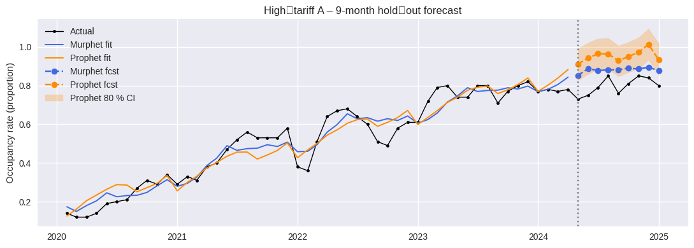
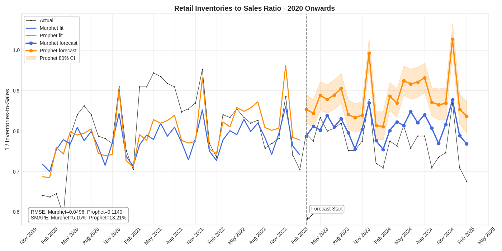
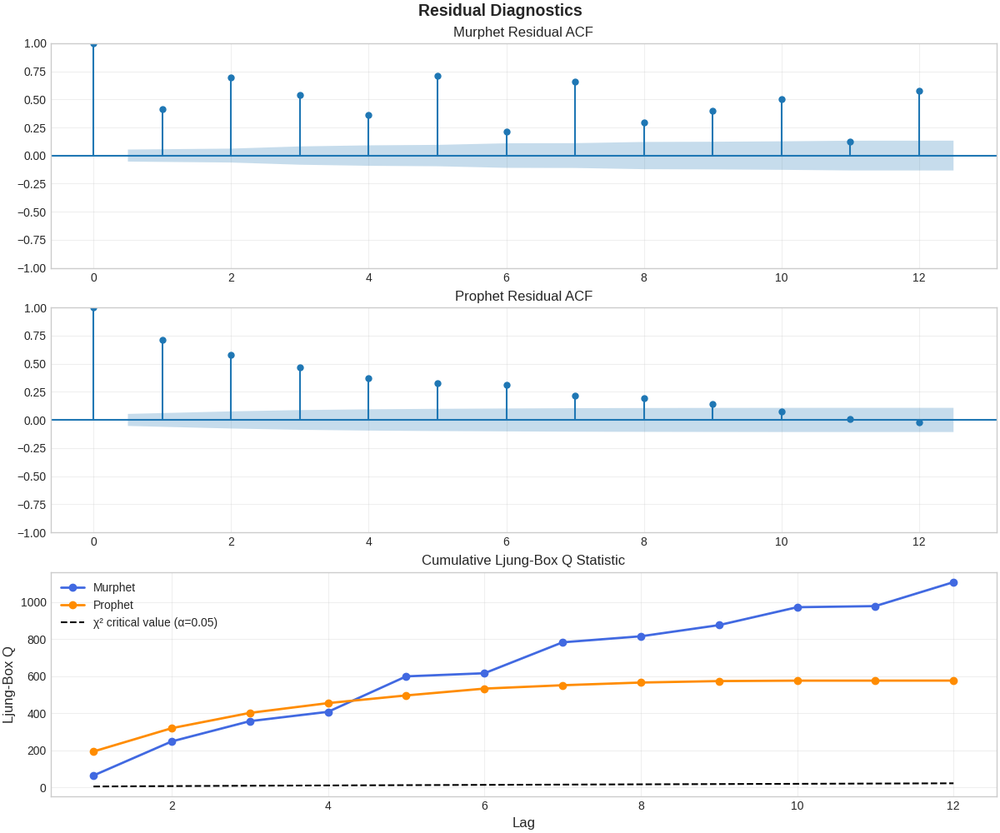

# 📈 Murphet  — Prophet’s (0‑1) cousin for probabilities & rates  

[](https://pypi.org/project/murphet/)
[](https://www.python.org/)
[](LICENSE)

> A Stan‑powered time‑series model that **never breaks the 0 – 1 bounds** and still feels like Prophet.

---

## 1 · Why Murphet?

| Problem with vanilla Prophet | How Murphet fixes it |
|------------------------------|-----------------------|
| Forecasts of *rates* can shoot \< 0 or \> 1 | **Beta head** maps μ → (0, 1) automatically |
| Constant‑variance Gaussian noise mis‑prices tails | Mean‑dependent **Beta / Student‑t** likelihoods |
| Hard CPs create kinks; few data → over‑fit | **Smooth logistic** changepoints + Laplace shrinkage |
| Season coefficients often blow up | Weak‑Normal (σ≈10) priors, optional horseshoe |
| Residual AR left untreated | **Latent AR(1)** disturbance (ρ, μ₀) |
| One‑size‑fits‑all variance | **Heteroscedastic φᵢ/σᵢ** via log‑linear link |

---

## 2 · Installation

```bash
pip install murphet              # wheels include pre‑compiled Stan models
```

### Requirements

* Python ≥ 3.8 & CmdStanPy ≥ 1.0 (auto‑installed)
* A recent CmdStan toolchain (gcc/clang) — `cmdstanpy.install_cmdstan()` will fetch it.

---

## 3 · Quick start

```python
import pandas as pd, numpy as np
from murphet import fit_churn_model

df = pd.read_csv("churn_data.csv")        # cols: ds, y  (0<y<1)
df["ds"] = pd.to_datetime(df["ds"])
df["t"]  = np.arange(len(df))             # integer index

mod = fit_churn_model(
        t              = df["t"],
        y              = df["y"],
        periods        = 12, num_harmonics = 3,    # yearly seasonality
        n_changepoints = 4,
        likelihood     = "beta",                   # default & safest
        inference      = "nuts",                   # full posterior
      )

future_t = np.arange(len(df), len(df)+6)
fcst     = mod.predict(future_t)
```

---

## 4 · Model internals (nutshell)

| Component | Equation | Note |
|-----------|----------|------|
| Trend | *μ<sub>det</sub>(t) = k·t + m + ∑ δ<sub>j</sub> σ(γ (t − s<sub>j</sub>))* | smooth CP ramps |
| Seasonality | Fourier blocks on raw *t* (`fmod`) | multiple periods OK |
| Link / saturation | *μ* → `logit⁻¹` → *p* | optional |
| Likelihoods | **Beta(p·φᵢ,(1‑p)·φᵢ)**   or   **Student‑t<sub>ν</sub>(μ,σᵢ)** | φᵢ / σᵢ heteroscedastic |
| Latent error | *y\* = μ<sub>det</sub> + ρ·lag* | AR(1) disturbance |

### Add‑ons implemented

| ✔ add‑on | Stan code snippet | Effect |
|----------|------------------|--------|
| **AR(1)** latent error | `real<lower=-1,upper=1> rho; real mu0;` + update in `partial_sum_*` | absorbs slow drifts / residual autocorr |
| **Heteroscedastic precision / scale** | `phi_i = exp(log_phi0 - beta_phi*abs(mu_det));` (Beta) / `sigma_i = exp(log_sigma0 + beta_sigma*abs(mu_det));` (Gauss) | wider tails when level high |
| **Heavy‑tail option** | `student_t_lpdf(y | ν, μ, σᵢ)` with `ν ~ Exp(1/30)` | cushions outliers |

---

## 5 · Case‑studies

### 5 a · Hong‑Kong hotel occupancy *(monthly, 2020‑2025)*  
[Source link](https://www.tourism.gov.hk/datagovhk/hotelroomoccupancy/hotel_room_occupancy_rate_monthly_by_cat_en.csv)



| Hold‑out horizon | RMSE |
|------------------|------|
| **Murphet β**    | **0.0908** |
| Prophet (optimised) | 0.1578 |

### 5 b · U.S. Retail Inventories‑to‑Sales Ratio *(FRED RETAILIRNSA)*



| Hold‑out (24 mo) | RMSE | SMAPE |
|------------------|------|-------|
| **Murphet β**    | **0.0496** | **5.15 %** |
| Prophet          | 0.1140 | 13.21 % |

Residual check:



Murphet’s AR(1)+heteroscedastic head slashes autocorrelation; Prophet still shows structure.

---

## 6 · Which head to choose?

| Head | Use‑case | Link | Likelihood |
|------|----------|------|------------|
| **β (default)** | Proportions, CTR, churn %, conversion % | *logit⁻¹* | `Beta(p·φᵢ,(1‑p)·φᵢ)` |
| **Gaussian / Student‑t** | Ratios “around” 0.4–1.0 or unbounded KPI | identity | `Normal/Student‑t(μ,σᵢ)` |

Switch with `likelihood="gaussian"`; all other API calls identical.

---

## 7 · API cheat‑sheet

| Function | Purpose |
|----------|---------|
| `fit_churn_model(t, y, **kwargs)` | fit (MAP, ADVI, or NUTS) |
| `model.predict(t_new)` | fast vectorised prediction |
| `model.fit_result` | access raw CmdStanPy object |
| `model.summary()` | pretty DataFrame of posteriors |

Key kwargs:

```text
periods, num_harmonics         # seasonality
n_changepoints, delta_scale    # trend flexibility
gamma_scale                    # CP steepness
season_scale                   # weaken/strengthen Fourier priors
likelihood  = "beta"|"gaussian"
inference   = "map"|"advi"|"nuts"
```

---

## 8 · Road‑map

* Holiday regressors (Prophet style)  
* Prophet‑like plotting helpers  
* Automatic Stan/C++ speed‑ups for long MCMC chains

---

## 9 · Citing Murphet

If you use Murphet in academic work, please cite:

```
Murphy, S. (2025). Murphet: A Bayesian Time‑Series Model for Bounded Rates.
https://github.com/halsted312/murphet
```

---