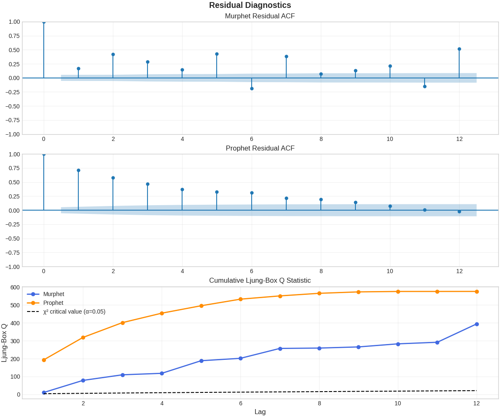

# **Murphet** — Bayesian forecasting for rates, ratios & percentages  
*A modern re-imagining of Prophet focused on 0-1 data*

[](https://pypi.org/project/murphet/)
[](https://pypi.org/project/murphet/)
[](https://opensource.org/licenses/MIT)

> **Murphet** is a Stan-powered, changepoint-aware time-series model with two
> interchangeable likelihood heads:  
> **β-head** for anything bound in (0, 1) | **Student-t head** for real-valued data.  
> It keeps the clean API you know from Prophet while adding probabilistic
> soundness (no predictions outside valid bounds), smoother trend changes, and
> extra robustness options.

---

## 📦 Installation

```bash
pip install murphet                       # installs CmdStanPy if needed
```

> **Tip ▶** on Apple Silicon / Linux you'll be asked to let CmdStanPy download a
> C++ tool-chain the first time; that's normal.

---

## 🚀 Quick start

```python
import pandas as pd, numpy as np
from murphet import fit_churn_model       # main entry-point

# --- data frame with ds/y ----------------------------------------------------
df = pd.read_csv("hotel_room_occupancy_rate_monthly_by_cat_en.csv")
df = (df
        .rename(columns={"Year-Month": "ds",
                         "Hotel room occupancy rate of high tariff A hotels": "y"})
        .assign(ds = pd.to_datetime(df["ds"].astype(str), format="%Y%m"))
        .sort_values("ds", ignore_index=True))

df["y"] = df["y"] / 100           # convert % → proportion  (strictly in 0-1)
df["t"] = np.arange(len(df))      # numeric index for Stan

# --- fit: yearly seasonality, mild trend flexibility -------------------------
model = fit_churn_model(
          t              = df["t"],
          y              : df["y"],
          periods        = 12.0,          # season length = 12 months
          num_harmonics  = 3,             # Fourier order
          n_changepoints = 4,
          delta_scale    = 0.05,
          likelihood     = "beta",        # (0-1) target → choose β-head
          inference      = "nuts")        # full posterior (NUTS)

# --- forecast next year ------------------------------------------------------
h = 12
future_t = np.arange(df["t"].iat[-1] + 1, df["t"].iat[-1] + 1 + h)
y_hat    = model.predict(future_t)
```

A richer example that **Optuna-tunes** hyper-parameters and compares Prophet
lives in  
[`examples/Hotel_occupancy.ipynb`](../examples/Hotel_occupancy.ipynb).

---

## 🔍 Why Murphet instead of Prophet?

| Feature | Prophet | **Murphet** |
|---------|---------|-------------|
| ⛓ **Valid bounds** | Manual logistic cap | *Built-in* logit link, never crosses 0/1 |
| 🧮 **Likelihood** | Normal / Student-t | **Beta** (0-1) *or* Student-t |
| ↩ **Changepoints** | Hard piece-wise linear | Smooth logistic ramps (`γ`) |
| 🔄 **Latent error** | – | Optional **AR(1)** disturbance (`ρ`, `μ₀`) |
| 📈 **Heteroscedasticity** | – | `φᵢ = e^{log φ₀ – β_φ·|μ_det|}` (β-head)<br>`σᵢ = e^{log σ₀ + β_σ·|μ_det|}` (t-head) |
| 🔋 **Heavy tails** | Student-t noise only | Student-t *or* β-head with φ-scaling |

### Real-world benchmarks  
(all tuned with Optuna rolling-origin CV)

| Dataset | Horizon | RMSE Murphet-β | RMSE Prophet | Δ (%) |
|---------|---------|---------------:|-------------:|------:|
| **Hotel occupancy (HK)** <br>[(link)](https://www.tourism.gov.hk/datagovhk/hotelroomoccupancy/hotel_room_occupancy_rate_monthly_by_cat_en.csv) | 9 mo | **0.091** | 0.158 | **-42 %** |
| **Retail Inventories-to-Sales** <br>[(FRED RETAILIRNSA)](https://fred.stlouisfed.org/series/RETAILIRNSA) | 12 mo | **0.050** | 0.114 | **-56 %** |


Residual diagnostics show smaller Ljung–Box Q and lower ACF spikes for Murphet β:

<p align="center"></p>

---

## 🧠 Parameter reference

| Argument | Type | Default | What it does |
|----------|------|---------|--------------|
| `periods` | float / list | 12.0 | Season length(s) in *t* units |
| `num_harmonics` | int / list | 3 | Fourier order per period |
| `n_changepoints` | int | ⌈0.2 N⌉ | Potential trend shift locations |
| `delta_scale` | float | 0.05 | Laplace prior width on δ (trend bends) |
| `gamma_scale` | float | 3.0 | Controls how steep each logistic CP is |
| `season_scale` | float | 1.0 | Scales seasonality priors (`σ ≈ 10·scale`) |
| `likelihood` | `"beta"`\|`"gaussian"` | "beta" | Choose head: β (0-1) or Student-t |
| `inference` | "map"\|"advi"\|"nuts" | "map" | Optimiser, variational, or full NUTS |
| `chains / iter` | ints | 4 / 2000 | MCMC settings (NUTS only) |

Extended priors (`beta_phi`, `log_sigma0`, `beta_sigma`, `nu`) are set internally
with conservative defaults-–see [`stan_reference.md`](stan_reference.md) for the
exact formulas.

---

## 🎛️ Hyper-parameter tuning with Optuna

```python
import optuna, numpy as np
def search_space(trial):
    return dict(
        periods=[12.0],
        num_harmonics=[trial.suggest_int("harm",1,4)],
        n_changepoints=trial.suggest_int("cp",0,8),
        delta_scale=trial.suggest_float("delta",0.01,0.4,log=True),
        gamma_scale=trial.suggest_float("gamma",1,10),
        season_scale=trial.suggest_float("sea",0.5,2.0),
        likelihood="beta", inference="map", seed=42)

def objective(trial):
    cfg = search_space(trial)
    fit = fit_churn_model(t=t_train, y=y_train, **cfg)
    preds = fit.predict(t_val)
    return np.sqrt(np.mean((y_val - preds)**2))

study = optuna.create_study(direction="minimize")
study.optimize(objective, n_trials=50)
```

Recipes for rolling-origin CV and pruning are in
[`docs/optuna_recipes.md`](optuna_recipes.md).

---

## 📚 Further reading

* [**Quick start**](quickstart.md) – end-to-end 20-line example  
* [**Advanced usage**](advanced_usage.md) – priors, Stan snippets, diagnostics  
* [**Stan reference**](stan_reference.md) – every parameter & default prior  
* [Jupyter notebook – *Hotel occupancy*](../examples/Hotel_occupancy.ipynb)  
* [Jupyter notebook – *Retail IR*](../examples/optuna_retail_murphet_vs_prophet.py)

---

## ✨ Contributing

PRs are welcome — especially for:

* additional likelihood heads (Gamma, Negative-Binomial)
* holiday / regression components
* documentation improvements & typos

Run the full test-suite with:

```bash
pip install -e ".[dev]"
pytest -q
```

---

© 2025 Stephen Murphy – MIT License